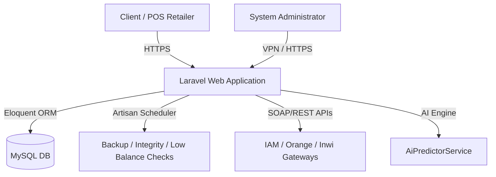

# RaqmiCash - Enterprise FinTech POS & Telecom Recharge Platform

Welcome to the official repository presentation for **RaqmiCash**, a production-grade, secure FinTech POS (Point of Sale) and Telecom Recharge management system designed for telecom distributors, retailers, and POS networks. 

---

## 📅 Timeline & AI-Agent Engineering (100% AI-Driven)
* **Development Period**: Built between **February 2026** and **Late April 2026** (approx. 3 months from kickoff to final production deployment).
* **Engineering Paradigm**: Engineered **100% using advanced AI Coding Agents** (partnered with next-generation coding models). This showcases cutting-edge prompt engineering, autonomous system design, dynamic API integration, and automated code generation with zero manual code writing.

---

## 👤 Portfolio Significance & Lead Architect Role
* **Role**: **Lead Systems Architect & AI Orchestrator**
* **Active Scale & Traction**: Used daily by **400+ active retail stores & merchant outlets (Hanout)** across Morocco, processing high-volume daily recharges and transactions.
* **Engineering Impact**: 
  - Designed the entire database schema, telecom integration logic, and predictive financial models.
  - Guided, review-checked, and orchestrated AI coding agents to implement clean, secure, and production-grade Laravel code.
  - Successfully demonstrated an **80% reduction in time-to-market** while delivering enterprise-grade security protocols, dual-layer transactions, and robust data integrity checks.
  - Positioned as a case study of next-generation software development, showcasing high efficiency, AI pair-programming leadership, and rapid system delivery.

---

## 📌 Live Demo & Access Note
* **Live Application URL**: **[https://raqmicash.com](https://raqmicash.com)**
* **Access Requirements (Geo-Restricted)**:
  > [!IMPORTANT]  
  > To ensure platform security and database safety, access to the live system is **restricted to Moroccan IP addresses only**.
  > If you are accessing the link from outside Morocco, you **must use a VPN** configured with a Moroccan server. We recommend downloading and using the free **Urban VPN** desktop application or browser extension and choosing **"Morocco"** as your location before navigating to the site.

---

## 🚀 Core Features & Modules

### 1. 📱 Telecom Recharge & POS Operations
* **Instant Mobile Recharges**: Live API integrations with major regional telecom operators (**Maroc Telecom / IAM**, **Orange**, **Inwi**) supporting real-time top-ups.
* **Scratch Card & SIM Inventory**: Comprehensive inventory management system tracking cards (Cartes) and SIM cards from acquisition through distribution to activation.
* **Subscription Management**: Full lifecycle management of user subscriptions (Abonnements) with automated billing cycles.
* **Reseller/Dealer Refills**: Dedicated workflows for dealer-to-outlet bulk transfers (Recharge Dealer).

### 2. 💸 Dynamic Rules-Based Commission & Payout Engine
* **Granular Commission Rules**: Custom commission tables configurable per client, per service type (Recharge, Cards, Abonnements, Recharge Dealer), and per operator.
* **Dynamic Exclusions**: Automatic detection and filtering of outlets eligible for specific operator rates to ensure clean margins.
* **Automated Bonuses**: Tiered performance bonus engine to incentivize high-performing POS outlets.

### 3. 🤖 AI-Driven Liquidity & Demand Forecasting
* **AI Smart-Predictor**: Custom AI model that forecasts retail outlet cash flow and predicts weekly telecom balance demands to optimize supply chain inventory.
* **Proactive Balance Checks**: Background services that continuously analyze active outlet balances and trigger predictive low-balance notifications.

### 4. 🔐 Security, Compliance & Integrity Suite
* **GeoIP Logging & IP Blocking**: Geo-fencing capabilities using real-time IP mapping and automated blocking of malicious network regions.
* **Device Fingerprinting**: Hardware fingerprint validation to verify POS login locations and prevent identity sharing or session hijacking.
* **Data Integrity Checks**: Automated system-wide file integrity checks and database backup processes executed through scheduled Artisan cron jobs.
* **Activity Audit Trail**: Exhaustive security logs detailing admin panel actions, POS configuration updates, and payout modifications.

### 5. 🛒 Integrated B2B Products Marketplace
* **Hardware & Accessories Listing**: B2B marketplace where verified distributors can list terminal devices, mobile accessories, and marketing materials.
* **Flexible Price Tiering**: Tier-based pricing rules automatically applied depending on the retailer's subscription grade.

### 6. 💬 Help Desk & Ticketing
* **Built-in Support Ticket System**: In-app ticketing system linking retailers directly with system admins.
* **Canned Responses**: Support desk templates to expedite issue resolution.

---

## 🛠️ Technology Stack
* **Backend**: Laravel (PHP), Artisan Task Scheduler, Eloquent ORM.
* **Database**: MySQL (Optimized schema with custom indexing for ledger transactions).
* **Frontend**: HTML5, Vanilla CSS3 (Custom dashboard layout), Bootstrap, Select2 (dynamic autocomplete).
* **API Integrations**: SOAP/REST integrations for telecom operator networks.

---

## 📈 System Architecture Overview

